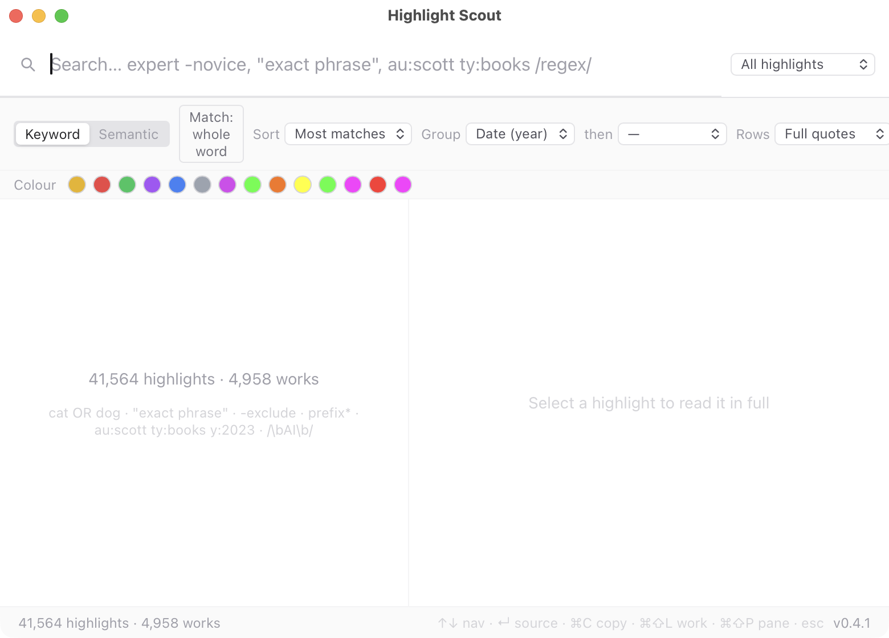

# Highlight Scout

**Lightning-fast, keyboard-first search across all your reading highlights** —
books, articles, papers, the lot — in one place. Results appear as you type,
everything is driven from the keyboard, and it all runs locally. Free, open
source, and your data never leaves your machine.

🌐 [highlightscout.app](https://highlightscout.app) · [Download](../../releases) · [Feedback / issues](../../issues)



## Import from anywhere

You don't need any particular service. Bring highlights from:

- **CSV** — any export, with a column-mapping screen (map your columns to
  title/author/text/note/…; it remembers the mapping per file type).
- **Kindle** — your device's `My Clippings.txt`.
- **JSON** — Highlight Scout's own format (also what *Export* produces), so you
  can script your own importer for any tool.
- **Readwise** — via the export API (optional; needs your access token).
- **Zotero** — read straight from the local database (optional; no account, no
  running Zotero needed). Annotation colours and types are kept.

Re-importing the same file never creates duplicates.

## Search

- **Instant keyword search**, sub-second on tens of thousands of highlights, with
  a real query grammar (below). Whole-word or partial matching.
- **Reading pane** with matched terms highlighted, full metadata, citations, and
  inline images.
- **Sort, group, filter** — by work/author/year/tag, by source, by colour.
- **Semantic search** (find by meaning) and **✦ Find related** — optional, via
  the local [QMD](https://www.npmjs.com/package/@tobilu/qmd) engine if installed.

### Query syntax

One word matches as-is; two words require both; three or more match any (ranked
by how many hit).

- `cat OR dog` · `book AND chapter` · `-exclude` · `"exact phrase"` · `prefix*` · `/\bAI\b/` regex
- Fields: `au:` `ti:` `ty:` `tag:` `co:` `after:` `before:` `y:2023`

## Install

Download the latest build from the [Releases](../../releases) page:

- **macOS** — open the `.dmg`, drag to Applications. First launch: right-click →
  **Open** (the app is not yet notarised).
- **Windows** — unzip the portable build and run `highlight-scout.exe`. No
  installer; if SmartScreen warns, choose **More info → Run anyway**.

> **Note:** the macOS and Windows downloads are built automatically by CI and
> have **not yet been tested on a clean machine**. If anything doesn't work,
> please [open an issue](../../issues) — feedback is very welcome.

Then **Import ▾** your highlights and start searching. The hotkey **⌘⌥⇧H**
(Ctrl+Alt+Shift+H) toggles the window from anywhere.

## Keyboard

| Key | Action |
| --- | --- |
| `⌘⌥⇧H` | Show / hide the window |
| `↑` `↓` · `↵` | Navigate · open source |
| `⌘C` · `⌘⇧C` | Copy highlight · copy as Markdown |
| `⌘⇧L` · `⌘⇧N` | Work highlights · open work in new window |
| `⌘⇧F` | Find related (semantic) |
| `⌘⇧P` · `?` | Command palette / shortcuts |
| `⌘\` · `⌘,` | Toggle reading pane · settings |

All shortcuts are remappable in **Settings → Shortcuts**.

## How it stores things

- **Archive** — Markdown, one file per work, in a folder you choose (default
  `~/Documents/Highlight Scout/`). Human-readable and portable; your highlights
  outlive the app.
- **Index** — a generated SQLite search index in the app's data folder, rebuilt
  from the Archive at any time.

## Build from source

Requires [Bun](https://bun.sh) and the Rust toolchain.

```bash
bun install
bun run tauri dev      # run in development
bun run tauri build    # build a release app
```

## Licence

MIT — see [LICENSE](LICENSE).
